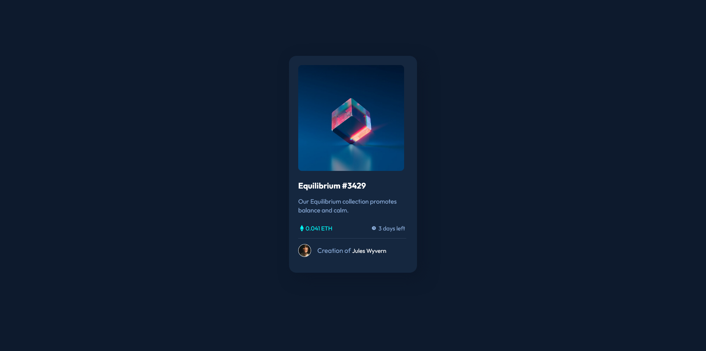

# Frontend Mentor - NFT preview card component solution

This is a solution to the [NFT preview card component challenge on Frontend Mentor](https://www.frontendmentor.io/challenges/nft-preview-card-component-SbdUL_w0U). Frontend Mentor challenges help you improve your coding skills by building realistic projects. 

## Table of contents

- [Overview](#overview)
  - [The challenge](#the-challenge)
  - [Screenshot](#screenshot)
  - [Links](#links)
- [My process](#my-process)
  - [Built with](#built-with)
  - [What I learned](#what-i-learned)
  - [Continued development](#continued-development)
  - [Useful resources](#useful-resources)
- [Author](#author)
- [Acknowledgments](#acknowledgments)

## Overview

### The challenge

Users should be able to:

- View the optimal layout depending on their device's screen size
- See hover states for interactive elements

### Screenshot

### Links

- Solution URL: [GitHub](https://github.com/laceeder/nft-preview-card)
- Live Site URL: [Vercel](https://nft-preview-card-two-alpha.vercel.app/)

## My process

### Built with

- Semantic HTML5 markup
- CSS custom properties
- Flexbox
- Mobile-first workflow

### What I learned

Learned how to use the hover selector and how to style it.

### Continued development

I would like to further explore what I can do with the hover selector. Also would need to explore how to use SASS. I did not use it in this challenge because I have never used it before.

### Useful resources

- [W3Schools](https://www.w3schools.com/cssref/sel_hover.asp) - This helped me play around with the various ways I used the hover selector and try different things out.

## Author

- Frontend Mentor - [@laceeder](https://www.frontendmentor.io/profile/laceeder)
- Github - [@laceeder](https://github.com/laceeder)

## Acknowledgments

I saw [@Bayoumi-dev] on Frontend Mentor explain to another user how to use the hover selector and what stylings they needed in their solution. Reading through their explanation also helped me understand the hover property a lot better and how I would need to style it in CSS and why! Very helpful!